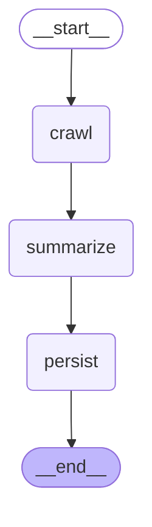

# SKU Notice Ingest Graph

```mermaid
---
config:
  flowchart:
    curve: linear
---
graph TD;
    __start__([<p>__start__</p>]):::first
    crawl(crawl)
    summarize(summarize)
    persist(persist)
    __end__([<p>__end__</p>]):::last
    __start__ --> crawl;
    crawl --> summarize;
    summarize --> persist;
    persist --> __end__;
    classDef default fill:#f2f0ff,line-height:1.2
    classDef first fill-opacity:0
    classDef last fill:#bfb6fc
```
